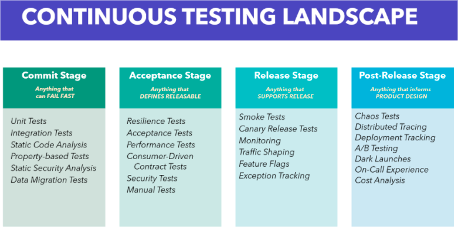

---
title: "Continuous testing"
linkTitle: "Continuous testing"
weight: 7
description: >
  Automated testing helps you to consistently check your software and find
  problems faster.
---

- [Why Continuous Testing](#heading-wct)
  - Associated DORA capabilities
- [Definition](#heading-def)
- Key stakeholders
- Best practices
- Relationship to other practices

# Why Continuous Testing {#heading-wct}
## Find issues fast
Continuous testing allows you to get the fastest possible feedback on the status of your application enhancements. Test feedback will go directly to those who are in the best position to remediate any found issues – the developers. The longer an issue exists in the code (or design) of a given work item, the more costly it becomes to resolve. Finding issues as soon as they arise will save unnecessary asset expenditure while improving quality and maintaining a high-quality standard.

## Minimize Slow, Manual Testing
Shift-left testing prevents the need for long, drawn out and error prone manual test processes at the end of the development cycle. Manual testing can now focus on exploratory aspects to increase the testable knowledge of the system being developed and apply the newly gained knowledge to further automated test development.

## Reduce Business Risk
Stakeholders expectations must be continuously met. Finding gaps in the system/feature later in the development cycle can cause undue setbacks. Continuous testing enables identifying these gaps as actionable items which can be prioritized early in the development cycle.

## Improved Test Effectiveness/Quality
Continuously using automated tests bolsters the need for high quality, high value tests. Unnecessarily long feedback loops can occur where too many low value tests are being run as part of continuous testing. Removing the low value tests or improving the effectiveness of tests is commonplace in continuous testing due to the high return on investment. This ultimately leads to faster development cycles with a higher quality standard.

## Developer On-boarding/System Documentation
It is often the case that key knowledge about how a product or feature works may largely reside within individuals, making them possible bottlenecks or points of failure for fixing bugs or making additions in a timely manner.  A strong and reliable automated test system ensures that any developer has the ability to safely make changes in code they may not have a strong background in, acting as a safety net to ensure incompatible changes are not introduced.  It also acts as a form of developer documentation for how the system actually works in a validatable way.

# Definition {#heading-def}
Getting fast feedback on the impact of changes throughout the software delivery lifecycle is the key to building quality into software. Testing is not something that we should only start once a feature is "dev complete." 
Because testing is so essential, we should be continuously performing all types of testing as an integral part of the development process.
Not only does this help teams build (and learn how to build) high-quality software faster; DORA's research shows that it also improves software stability, reduces team burnout, and lowers deployment pain.
Description/Scope
All types of automated testing (unit, integration, acceptance, etc) should be run against every commit to version control to give developers fast feedback on their changes. Developers should be able to run automated tests as much as possible on their workstations to triage and fix defects. Testers should be performing exploratory testing continuously against the latest builds to come out of CI stage.

# Best Practices
 
## Manual Testing
Allow testers to work alongside developers throughout the software development and delivery process. Note that "tester" is a role, not necessarily a full-time job. Perform manual test activities such as exploratory testing and usability testing throughout the delivery process.

## Testing in Production
Being able to successfully and safely test in production requires a significant amount of automation and a firm understanding of best practices.
The best effort simulation of the production environment is the production environment itself. Why using a “staging” environment is not always the best idea:
size of the staging cluster, sometimes it’s a single machine used as a cluster
configuration options (load balancers, databases, queues, etc) for every service will be different than production because of costs for example
the lack of monitoring for the “staging” environment. Even if monitoring exists, several staging monitoring signals could end up being completely inaccurate given that one is monitoring a “different” environment than the production environment.

### Techniques:
- During release: canary releasing, feature flagging, monitoring
- During post-release: profiling, distributed tracing, chaos testing, A/B testing

## Continuous Testing Landscape

